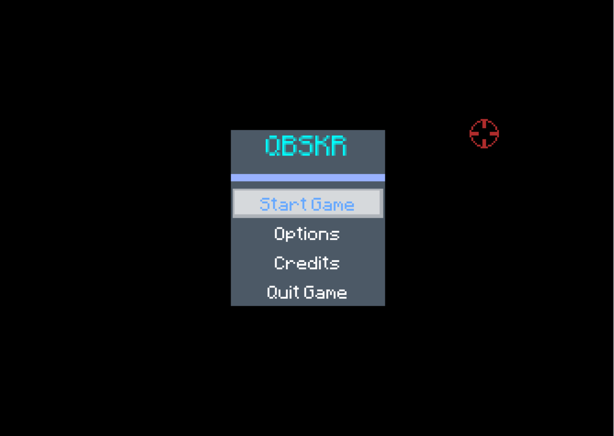

# QBSKR (Quanmcvn's Bad Soul Knight Replica)
> Inspired by Soul Knight, in C++ with SDL2 (and with help of SuperTux's open sourced code).

<p align="center">
	
</p>


## Intallation
The executable is called `QBSKR` in `data/`

The project requires common SDL2 libary: `SDL2, SDL2-image, SDL2-mixer, SDL2-ttf`

### Window:
Tested in Windows 7/10 so it should work fine.

Download (or clone) the code and open the executable

If it doesn't work:

- Install [`MinGW`](https://nuwen.net/mingw.html)
- Install [`SDL2`](https://github.com/libsdl-org/SDL/releases),
[`SDL2-image`](https://github.com/libsdl-org/SDL_image/releases),
[`SDL2-mixer`](https://github.com/libsdl-org/SDL_mixer/releases),
[`SDL2-ttf`](https://github.com/libsdl-org/SDL_ttf/releases),
set the variable `SDL2_*_PATH` in `Makefile` acordingly.

then
```
$ make
```

### Linux:

Tested only in Ubuntu 22.04.

Download or clone the code

Make sure you have SDL2 libraries:

```
# apt-get install libsdl2-dev libsdl2-image-dev libsdl2-mixer-dev libsdl2-ttf-dev
```

then

```console
$ make
```

**NOTE**: Other OS not considered yet.

## How to Play
WASD or arrow keys to move, left mouse button to attack and interact with menu, enter keys to also interact with menu

## Credit

### Code
80% (estimate) of code design came from SuperTux (but I work hard to understand)

*The code used my own ~~bad~~ epic parser to parse data of sprites, weapons, projectiles, badguys, ... from .txt files (to make it easy to cheat)*

### Images
[DungeonTilesetII_v1.4 By 0x72](https://0x72.itch.io/dungeontileset-ii)
